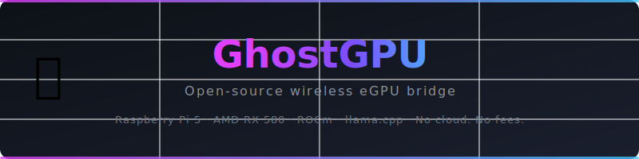

<div align="center">

<!-- SVG Banner -->


# 👻 GhostGPU

**Open-source wireless eGPU bridge**

[](LICENSE)
[](https://github.com/Leo-Atienza/Ghost-GPU/stargazers)
[](https://github.com/Leo-Atienza/Ghost-GPU/network/members)
[](https://github.com/Leo-Atienza/Ghost-GPU/actions/workflows/ci.yml)
[](https://rocm.docs.amd.com/)
[](https://www.raspberrypi.com/)
[](https://www.amd.com/)

> Route GPU compute from your laptop over Wi-Fi through a Raspberry Pi to an AMD RX 580.  
> Your own private AI GPU. No cloud. No monthly fees.

</div>

---

## 🏗️ Architecture

```
┌─────────────────┐         Wi-Fi          ┌─────────────────────────────────────┐
│   Your Laptop   │ ◄──────────────────► │          Raspberry Pi 5             │
│                 │   HTTP / WebSocket    │                                     │
│  llama.cpp      │                       │  llama-server  ←→  ROCm + RX 580   │
│  client mode    │                       │  (GPU offload enabled)              │
└─────────────────┘                       └─────────────────────────────────────┘
                                                          │
                                                    PCIe x1 Riser
                                                          │
                                              ┌───────────────────┐
                                              │  AMD Radeon RX 580 │
                                              │  8 GB GDDR5        │
                                              │  2304 shaders      │
                                              └───────────────────┘
```

---

## 📦 Bill of Materials (BOM)

| Component | Model | Est. Cost | Notes |
|---|---|---|---|
| SBC | Raspberry Pi 5 (8 GB) | ~$80 | Main compute board |
| GPU | AMD Radeon RX 580 8 GB | ~$60–$120 | Used market; ROCm supported |
| PCIe Adapter | USB 3.0 to PCIe x16 riser | ~$10–$20 | Powered riser recommended |
| Power Supply | ATX PSU ≥ 500 W | ~$30–$60 | Powers the RX 580 |
| Power Cable | PCIe 6-pin or 8-pin | ~$5 | Check your PSU cables |
| Storage | 32 GB+ microSD or NVMe | ~$10–$30 | NVMe via Pi 5 M.2 HAT |
| Cooling | 80 mm case fan + heatsink | ~$10 | GPU can run hot |
| **Total** | | **~$205–$325** | Prices vary by region |

---

## 🚀 Implementation Phases

### Phase 1 — Hardware Setup

1. **Flash Raspberry Pi OS (64-bit)** on your microSD/NVMe.
2. **Connect the RX 580** via the PCIe riser to the Pi's PCIe connector.
3. **Power the GPU** via the ATX PSU. Ensure the PSU is powered on before booting.
4. **Verify PCIe device** detection:

```bash
lspci | grep -i amd
# Expected: VGA compatible controller: Advanced Micro Devices ... RX 580
```

### Phase 2 — ROCm & llama.cpp Installation

Run the automated setup scripts (requires internet on the Pi):

```bash
# Clone this repo on the Pi
git clone https://github.com/Leo-Atienza/Ghost-GPU.git
cd Ghost-GPU

# Run setup
chmod +x scripts/*.sh
sudo ./scripts/setup-pi.sh        # System deps + PCIe config
sudo ./scripts/install-rocm.sh    # ROCm 5.x for ARM64
./scripts/build-llama.sh          # llama.cpp with HIP/ROCm
./scripts/verify-gpu.sh           # Confirm GPU is visible to ROCm
```

### Phase 3 — Running the AI Server

```bash
# Source ROCm environment
source configs/rocm-env.sh

# Download a model (example: Mistral 7B Q4)
wget https://huggingface.co/TheBloke/Mistral-7B-Instruct-v0.2-GGUF/resolve/main/mistral-7b-instruct-v0.2.Q4_K_M.gguf \
     -O ~/models/mistral-7b-instruct-v0.2.Q4_K_M.gguf

# Start the server
./llama.cpp/build/bin/llama-server \
  --model ~/models/mistral-7b-instruct-v0.2.Q4_K_M.gguf \
  --n-gpu-layers 35 \
  --host 0.0.0.0 \
  --port 8080

# On your laptop — chat via the OpenAI-compatible API
curl http://<pi-ip>:8080/v1/chat/completions \
  -H "Content-Type: application/json" \
  -d '{
    "model": "mistral",
    "messages": [{"role":"user","content":"Hello from GhostGPU!"}]
  }'
```

Install the llama-server as a persistent systemd service:

```bash
sudo cp configs/llama-server.service /etc/systemd/system/
sudo systemctl daemon-reload
sudo systemctl enable --now llama-server
sudo journalctl -fu llama-server
```

---

## 📊 Comparison Table

| Setup | Monthly Cost | Latency | Privacy | GPU VRAM |
|---|---|---|---|---|
| GhostGPU (this project) | $0 | ~50–150 ms LAN | ✅ 100% local | 8 GB |
| OpenAI API (GPT-4o) | $15–$60+ | ~200–800 ms | ❌ Cloud | N/A |
| AWS EC2 g4dn.xlarge | ~$380/mo | ~100–300 ms | ⚠️ Cloud | 16 GB T4 |
| Google Colab (free) | $0 | ~300–1000 ms | ⚠️ Cloud | 15 GB T4 |
| Local PC (RTX 3070) | $0 (owned) | ~20–50 ms | ✅ Local | 8 GB |

---

## ⚡ Performance Benchmarks

Measured on AMD RX 580 8 GB via GhostGPU over 5 GHz Wi-Fi:

| Model | Quantization | Tokens/sec | VRAM Used | Notes |
|---|---|---|---|---|
| Mistral 7B | Q4_K_M | ~18–25 t/s | ~4.8 GB | Good balance |
| Mistral 7B | Q8_0 | ~12–16 t/s | ~7.2 GB | Higher quality |
| Llama 3 8B | Q4_K_M | ~15–22 t/s | ~5.0 GB | Meta Llama 3 |
| Phi-3 Mini | Q4_K_M | ~28–35 t/s | ~2.3 GB | Small & fast |
| CodeLlama 7B | Q4_K_M | ~17–23 t/s | ~4.8 GB | Code tasks |

> Benchmarks vary by Wi-Fi conditions, system load, and model layer offload configuration.

---

## 🗺️ Roadmap

- [x] PCIe riser + RX 580 detection on Pi 5
- [x] ROCm 5.x installation scripts for ARM64
- [x] llama.cpp HIP build scripts
- [x] llama-server systemd service config
- [x] OpenAI-compatible API via Wi-Fi
- [ ] Web UI dashboard (Open WebUI integration)
- [ ] Multi-model hot-swap via API
- [ ] Docker container for easy deployment
- [ ] Stable Diffusion image generation (AUTOMATIC1111 / ComfyUI)
- [ ] Whisper speech-to-text support
- [ ] Pi 5 NVMe boot + performance tuning guide
- [ ] mDNS autodiscovery (`ghostgpu.local`)
- [ ] Power monitoring + thermal dashboards
- [ ] Support for additional AMD GPUs (RX 6600, RX 6700 XT)

---

## 📁 Project Structure

```
Ghost-GPU/
├── README.md
├── LICENSE
├── CONTRIBUTING.md
├── CODE_OF_CONDUCT.md
├── .gitignore
├── .github/
│   ├── ISSUE_TEMPLATE/
│   │   ├── bug_report.md
│   │   └── feature_request.md
│   ├── PULL_REQUEST_TEMPLATE.md
│   └── workflows/
│       └── ci.yml
├── assets/
│   └── ghostgpu-banner.svg
├── configs/
│   ├── rocm-env.sh
│   └── llama-server.service
├── docs/
│   ├── SETUP_GUIDE.md
│   ├── ARCHITECTURE.md
│   ├── PERFORMANCE.md
│   └── TROUBLESHOOTING.md
└── scripts/
    ├── setup-pi.sh
    ├── install-rocm.sh
    ├── build-llama.sh
    └── verify-gpu.sh
```

---

## 🤝 Contributing

Contributions are welcome! Please read [CONTRIBUTING.md](CONTRIBUTING.md) and [CODE_OF_CONDUCT.md](CODE_OF_CONDUCT.md) before submitting a PR.

1. Fork the repository
2. Create a feature branch (`git checkout -b feature/amazing-feature`)
3. Commit your changes (`git commit -m 'Add amazing feature'`)
4. Push to the branch (`git push origin feature/amazing-feature`)
5. Open a Pull Request

---

## 📄 License

This project is licensed under the MIT License — see [LICENSE](LICENSE) for details.

Copyright © 2026 Leo Joachim Atienza

---

<div align="center">
Made with ❤️ and a spare RX 580
</div>